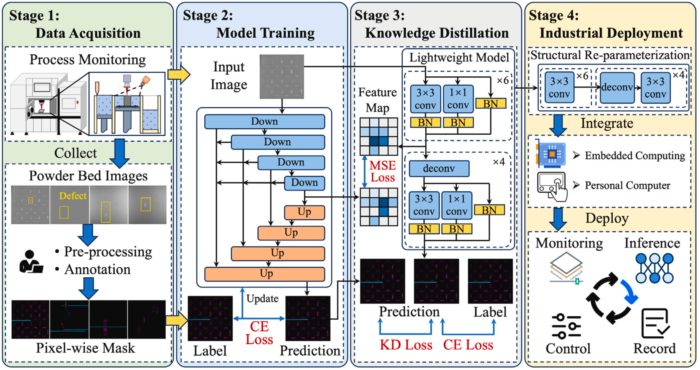

# LWAM: Efficient and lightweight layer-wise in-situ defect detection in laser powder bed fusion via knowledge distillation and structural re-parameterization [[Paper](https://www.sciencedirect.com/science/article/pii/S0957417424014957)]

## Abstract

Powder bed quality is critical in Laser Powder Bed Fusion (LPBF) as defects in the powder bed will affectthe quality of the forming parts. To address the challenges in industrial deployment of deep learning-based defect detection models, we propose a lightweight and efficient LPBF layer-wise defect detection paradigm to achieve a balance between performance and efficiency. Aiming at improving the performance of the lightweight model, we propose a structured Knowledge Distillation framework, in which a pre-trained high performance segmentation model (UNet++) is used to guide the training process of a lightweight model. To address the impact of model discrepancies on the effectiveness of Knowledge Distillation and further improve the inference speed, we construct a specific lightweight model and apply Structural Reparameterization to deeply compress the model. Moreover, we created a dataset comprising 406 images of powder-bed defects, with each image annotated at the pixel level. 



## Dataset

Comming soon.

## Documentation

* Install

Clone repo and install requirements.txt in a Python>=3.9.0 environment.

```sh
git clone https://github.com/aaahqiu/LWAM-main.git
cd LWAM-main
pip install -r requirements.txt
```

* Training

Open **train.py** and edit the args. Train the teacher model with:

```sh
CUDA_VISIBLE_DEVICES=0 torchrun --nnodes 1 --nproc_per_node 1 train.py
```

Open **train_distillation.py** and edit the args. Distillation to the student model with:

```sh 
CUDA_VISIBLE_DEVICES=0 torchrun --nnodes 1 --nproc_per_node 1 train_distillation.py
```

* Inference

Inference using your model with **test.py**.

```sh
python test.py
```

* Reparameterization

Reparameterization the RepVGG Block to a single conv layer with:

```python
from models import repvgg_model_convert

model = LWRNetF(n_classes=6)
model = repvgg_model_convert(model)
```

## Citation

```tex
@article{tan2024efficient,
  title={Efficient and lightweight layer-wise in-situ defect detection in laser powder bed fusion via knowledge distillation and structural re-parameterization},
  author={Tan, Kunpeng and Tang, Jiafeng and Zhao, Zhibin and Wang, Chenxi and Miao, Huihui and Zhang, Xingwu and Chen, Xuefeng},
  journal={Expert Systems with Applications},
  volume={255},
  pages={124628},
  year={2024},
  publisher={Elsevier}
}
```

